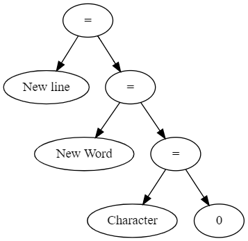
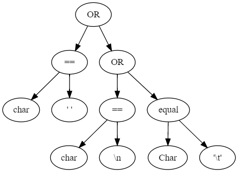
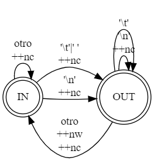

# Trabajo Practico N 5 (Contador de Palabras)

## Arbol de expresion
Condicion inicial 
$$line = words = Character = 0 $$

 

 
 
 

## Respuestas 
 * Ventajas y desventajas Wc (Enum-Switch)
   * Ventajas : 
     * Hay una semantica mejor definida que se asemaja al lenguaje natural 
     * Hay tanto una similitud de codigo con maquina de estados , lo que nos permite realizar un grafo y viceversa
     * Los switch se asemejan a la maquina de estados 
   * Deventajas :
     * Tiene una complejidad mayor a la hora de escribir el codigo 
 * K&R
   * ventajas: 
     * Mas simple para desarollar ya que no tiene otros tipos de datos 
   * Desventajas:
     * No se puede pasar del codigo a la maquina de estados tan facilmente , ya que es mas abstracto por medio de las variables int 

Uso del GOTO:
Los lenguajes modernos intentan no implementar goto, o saltos incondicionales en su totalidad. 
Un ejemplo de esto es Rust, en el cual goto ni siquiera se considera una palabra reservada del lenguaje.
